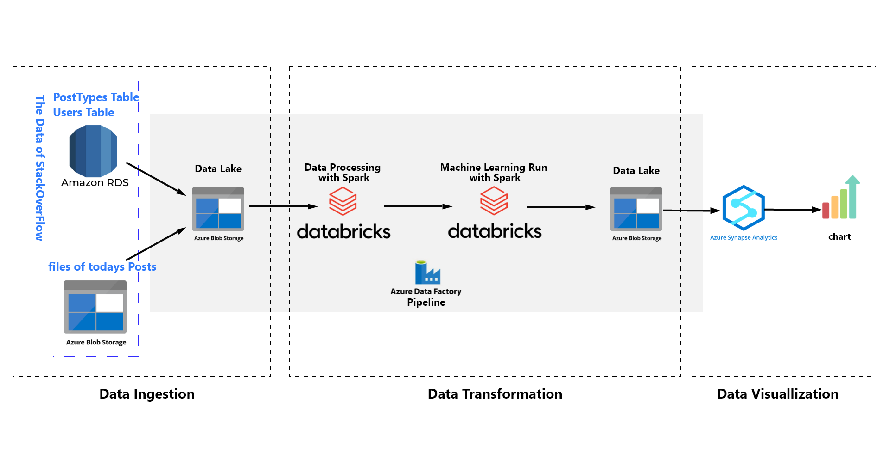

# Project Overview

This project demonstrates a comprehensive data engineering pipeline on Azure, utilizing various Azure services for data ingestion, transformation, machine learning, and visualization. The data is sourced from StackOverflow and processed through a series of steps to provide insightful visualizations of trending topics.

## Project Diagram

