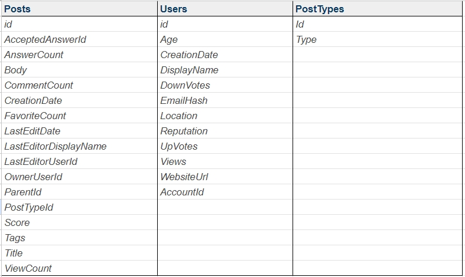
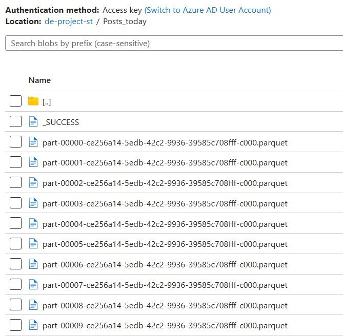

# About Data

## Data Background

The dataset is sourced from StackOverflow, an online community for IT developers. It includes daily posts, post types, and user information. The dataset has been updated to reflect current dates, ensuring that today's data is always available.

## Dataset Schema

- **Posts Table**: Contains information about each post, including IDs, content, and metadata.
- **Users Table**: Contains information about users, including IDs, demographics, and activity.
- **PostTypes Table**: Defines the type of each post.

## Data Sources

- **RDS (PostgreSQL)**: Hosts the Users and PostTypes tables.
  - Host: `ENTER YOUR HOST URL`
  - Master Username: `postgres`
  - Password: `weclouddatade`
  - Database: `stack`
  - Port: `5432`
- **Azure Storage Blob**: Stores daily Posts data in Parquet format.
  - Storage Account: `wcddestorageexternal`
  - Container: `de-project-st`
  - Folder: `Posts_today`
  - Access Key: `<ENTER YOUR ACCESS KEY>`

